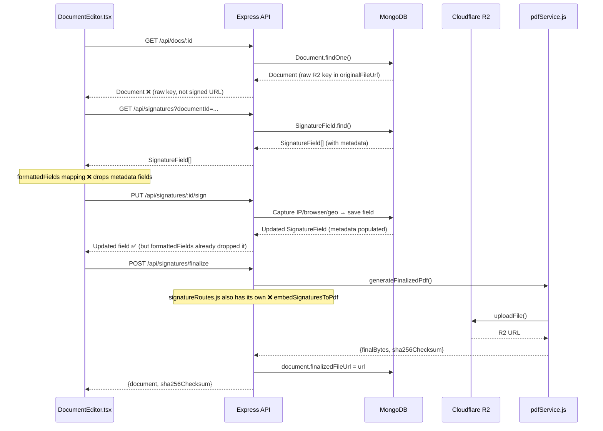
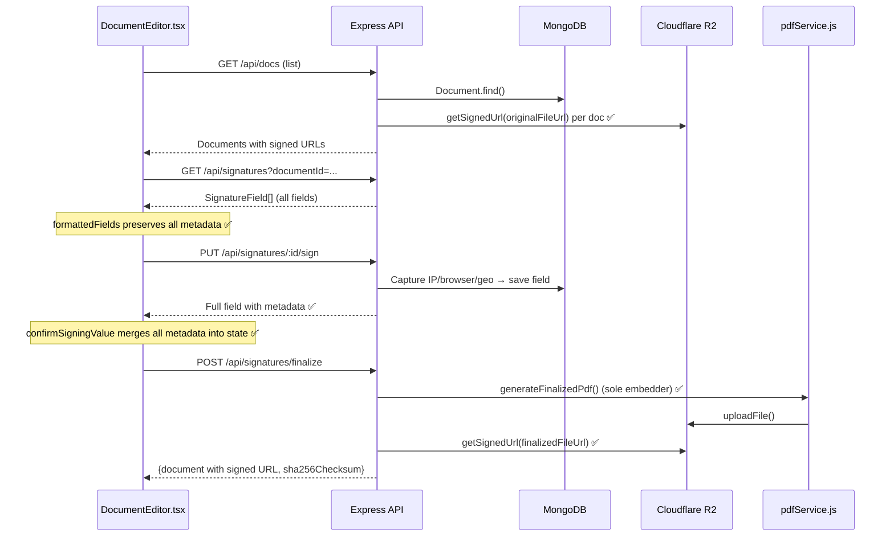

# Design Document: Premium Signature eSign

## Overview

This design covers four interconnected improvements to the SignFlow e-signature platform. Each targets a distinct layer of the stack but they share data flow through the `SignatureField` model — the single source of truth for placement, signing metadata, and rendering configuration.

The four areas are:

1. **Premium Signature UI** — Redesign the signing canvas and certificate panel to Adobe/DocuSign/Aadhaar quality using the Meta design system.
2. **Metadata Capture Fix** — Stop dropping `ipAddress`, `browser`, `device`, `operatingSystem`, `location`, and `isp` in the `formattedFields` mapping in `DocumentEditor.tsx`.
3. **PDF Embedding Reliability** — Consolidate the two conflicting `embedSignaturesToPdf` implementations and ensure the finalization pipeline always uses `pdfService.js`.
4. **Storage Persistence Fix** — Make `GET /api/docs` and `GET /api/docs/:id` resolve raw R2 keys to signed URLs before returning responses.

---

## Architecture

### Current Data Flow (with bugs annotated)



### Fixed Data Flow



---

## Components and Interfaces

### Frontend Components

#### 1. `SigningModal` (new component, extracted from `DocumentEditor.tsx`)

Extract the signing overlay into a dedicated component to contain the canvas, type, and upload tabs.

```
frontend/src/components/editor/
  SigningModal.tsx       ← new: drawing canvas, tabs, color swatches, validation
  CertificatePanel.tsx   ← new: post-signing certificate display
  DocumentEditor.tsx     ← existing: hosts both, passes props down
```

**`SigningModal` props interface:**

```typescript
interface SigningModalProps {
  isOpen: boolean;
  field: SignatureField;
  onConfirm: (signatureValue: string) => void;
  onClose: () => void;
}
```

**Canvas configuration (Requirement 1.2):**

```typescript
const CANVAS_CONFIG = {
  minWidth: 1.5,
  maxWidth: 4.0,
  velocityFilterWeight: 0.6,
  backgroundColor: 'rgba(0,0,0,0)',
  penColor: signatureColor,  // reactive to color picker state
};
```

**Color swatches (Requirement 1.6):**

```typescript
const INK_COLORS = [
  { label: 'Black', value: '#000000' },
  { label: 'Dark Gray', value: '#4A4A4A' },
  { label: 'Blue', value: '#0064E0' },   // Meta primary
];
```

**Undo history (Requirement 1.5):**

```typescript
const MAX_HISTORY = 10;
const drawingHistory = useRef<string[]>([]);
// On each stroke end: push canvas.toDataURL() to history (cap at MAX_HISTORY)
// On undo: pop last entry and restore canvas from second-to-last
```

#### 2. `CertificatePanel` (new component)

Replaces the inline certificate display in `DocumentEditor.tsx`.

```typescript
interface CertificatePanelProps {
  isOpen: boolean;
  field: SignatureField;          // must include all metadata fields
  sha256Checksum?: string;        // from document.sha256Checksum
  onClose: () => void;
}
```

The panel renders sections in this order:
1. Green verification banner (`bg-emerald-50 border-emerald-200`)
2. Dev environment warning (conditional, yellow `AlertTriangle`, when IP is 127.x or ::1)
3. Identity: Signer Name, Email
4. Event: Timestamp (`DD MMM YYYY • HH:MM UTC`), IP Address, Location, ISP
5. Device: Browser, Device, OS
6. Cryptographic: Certificate ID, Audit ID, SHA-256 fingerprint (monospace `bg-slate-900 text-slate-200`)
7. Compliance: Trust Score, Document Integrity, Signature Integrity, Audit Trail, Tamper Detection

**Timestamp formatter:**

```typescript
const formatTimestamp = (dateStr: string): string => {
  const d = new Date(dateStr);
  const months = ['Jan','Feb','Mar','Apr','May','Jun','Jul','Aug','Sep','Oct','Nov','Dec'];
  const day = String(d.getUTCDate()).padStart(2, '0');
  const month = months[d.getUTCMonth()];
  const year = d.getUTCFullYear();
  const hh = String(d.getUTCHours()).padStart(2, '0');
  const mm = String(d.getUTCMinutes()).padStart(2, '0');
  return `${day} ${month} ${year} • ${hh}:${mm} UTC`;
};
```

#### 3. `DocumentEditor.tsx` — Metadata Field Mapping Fix

The `formattedFields` mapping at line 1198 drops all metadata. Fix: preserve every field from the API response.

**Current (broken):**

```typescript
const formattedFields = sigResponse.data.map((sig: any) => ({
  _id: sig._id,
  type: sig.type || 'Signature',
  recipientEmail: sig.recipientEmail || currentUser?.email || '',
  xPercent: sig.xPercent !== undefined ? sig.xPercent : (sig.x || 35),
  yPercent: sig.yPercent !== undefined ? sig.yPercent : (sig.y || 40),
  widthPercent: sig.widthPercent || 15,
  heightPercent: sig.heightPercent || 5,
  page: sig.page || 1,
  status: sig.status || 'Pending',
  value: sig.value || sig.signatureValue || ''
}));
```

**Fixed:**

```typescript
const formattedFields = sigResponse.data.map((sig: any): SignatureField => ({
  _id: sig._id,
  type: sig.type || 'Signature',
  recipientEmail: sig.recipientEmail || currentUser?.email || '',
  signerName: sig.signerName,
  xPercent: sig.xPercent !== undefined ? sig.xPercent : (sig.x || 35),
  yPercent: sig.yPercent !== undefined ? sig.yPercent : (sig.y || 40),
  widthPercent: sig.widthPercent || 15,
  heightPercent: sig.heightPercent || 5,
  page: sig.page || 1,
  status: sig.status || 'Pending',
  value: sig.value || sig.signatureValue || '',
  // Metadata fields — preserve all
  ipAddress: sig.ipAddress,
  userAgent: sig.userAgent,
  browser: sig.browser,
  device: sig.device,
  operatingSystem: sig.operatingSystem,
  location: sig.location,
  isp: sig.isp,
  certificateId: sig.certificateId,
  auditId: sig.auditId,
  documentHash: sig.documentHash,
  tamperStatus: sig.tamperStatus,
  updatedAt: sig.updatedAt,
  // Scale controls
  signatureScale: sig.signatureScale ?? 100,
  metadataScale: sig.metadataScale ?? 'Medium',
  fontSize: sig.fontSize ?? 12,
  showDate: sig.showDate ?? true,
  showTime: sig.showTime ?? true,
  hideSha256: sig.hideSha256 ?? false,
  hideCertId: sig.hideCertId ?? false,
  hideReason: sig.hideReason ?? false,
}));
```

#### 4. Responsive Toolbar (Requirement 4)

The toolbar already has desktop/mobile branches. The changes are:
- Ensure the mobile Sign button calls the same `handleFinalizePDF` handler as desktop.
- Drawer close handler must not mutate signature state (already correct; document here is to verify and add test).
- Single-finger drag on the PDF canvas routes to scroll, not field placement (handled by checking `e.touches.length === 1` before triggering placement logic).

#### 5. Meta Design System Styling

Apply tokens from `DESIGN-meta.md` throughout the two new components:

| Token | Usage |
|---|---|
| `#0064E0` (primary) | Active ink color swatch, "Apply Signature" button |
| `#000000` (ink-button) | Default ink color, primary action buttons |
| `rounded-full` (100px) | All pill buttons |
| `rounded-2xl` (24px) | Modal card container |
| `text-[14px] font-bold tracking-[-0.14px]` | Button labels (button-md) |
| `bg-[#f1f4f7]` (surface-soft) | Canvas background |
| `border border-[#ced0d4]` (hairline) | Input borders |
| `text-[#0a1317]` (ink-deep) | Primary text |
| `text-[#5d6c7b]` (steel) | Secondary/caption text |

---

## Data Models

### `SignatureField` Schema (existing — no changes needed)

The model already contains `signatureScale`, `metadataScale`, and all metadata fields. No schema migration required.

```javascript
// Fields already present (no change):
signatureScale: { type: Number, default: 100 }
metadataScale:  { type: String, enum: ['Small', 'Medium', 'Large'], default: 'Medium' }
ipAddress:      { type: String, default: 'Unavailable' }
browser:        { type: String }
device:         { type: String }
operatingSystem: { type: String }
location:       { type: String, default: 'Unavailable' }
isp:            { type: String }
```

### API Response Contract Changes

**`PUT /api/signatures/:id/sign` — no server change needed**

The endpoint already saves all metadata and returns `res.json(field)` (the full Mongoose document). The only change is that `confirmSigningValue` in `DocumentEditor.tsx` must spread the response correctly — which it already does via `...response.data`. The root fix is in `formattedFields` so the initial state has the correct shape to merge into.

**`GET /api/docs` — add signed URL resolution**

```javascript
// After documents query, before res.json():
const docsWithUrls = await Promise.all(
  documents.map(async (doc) => {
    const plain = doc.toObject();
    if (isR2Active() && plain.originalFileUrl) {
      plain.originalFileUrl = await getSignedUrl(plain.originalFileUrl);
    }
    if (isR2Active() && plain.finalizedFileUrl) {
      plain.finalizedFileUrl = await getSignedUrl(plain.finalizedFileUrl);
    }
    return plain;
  })
);
res.json({ total, page, totalPages, documents: docsWithUrls });
```

**`GET /api/docs/:id` — add signed URL resolution**

```javascript
// After access check, before res.json():
const plain = document.toObject();
if (isR2Active() && plain.originalFileUrl) {
  plain.originalFileUrl = await getSignedUrl(plain.originalFileUrl);
}
if (isR2Active() && plain.finalizedFileUrl) {
  plain.finalizedFileUrl = await getSignedUrl(plain.finalizedFileUrl);
}
res.json(plain);
```

### PDF Service — Consolidation

**Problem:** `signatureRoutes.js` defines its own `embedSignaturesToPdf` (line 184). The finalize route calls `generateFinalizedPdf` from `pdfService.js`, which uses `pdfService.js`'s own `embedSignaturesToPdf`. The duplicate in `signatureRoutes.js` is dead code in the finalize pipeline but creates confusion and drift risk.

**Fix:** Delete the `embedSignaturesToPdf` function body from `signatureRoutes.js`. The finalize route already imports and uses `generateFinalizedPdf` from `pdfService.js` — no call site changes needed. `pdfService.js` remains the sole authoritative implementation.

The `pdfService.js` implementation already handles:
- PNG: `pdfDoc.embedPng(imageBuffer)` 
- JPEG: `pdfDoc.embedJpg(imageBuffer)`
- Typed: font selection from prefix, text centering
- Scale: `sigScaleFactor = (field.signatureScale || 100) / 100`
- Metadata scale: `field.metadataScale === 'Small'` / `'Large'` multipliers
- Null/empty value: `if (!field.value) continue`

No logic changes needed to `pdfService.js` — the implementation is correct. The bug is that under some code paths the duplicate in `signatureRoutes.js` was being invoked instead.

---

## Correctness Properties

*A property is a characteristic or behavior that should hold true across all valid executions of a system — essentially, a formal statement about what the system should do. Properties serve as the bridge between human-readable specifications and machine-verifiable correctness guarantees.*

### Property 1: Empty canvas blocks submission

*For any* signing modal state where the canvas contains no strokes (isEmpty() returns true), attempting to confirm the signature shall leave the modal open and display a validation error message, and no API call shall be made.

**Validates: Requirements 1.4**

---

### Property 2: Undo history is bounded

*For any* sequence of N strokes drawn on the canvas, the stored history array length shall never exceed 10, with older entries being evicted when the cap is reached.

**Validates: Requirements 1.5**

---

### Property 3: Certificate panel renders all metadata fields

*For any* `SignatureField` object with `status: 'Signed'` and all metadata fields populated, the rendered `CertificatePanel` output shall contain DOM elements displaying each of: signer name, email, IP address, location, browser, device & OS, certificate ID, audit ID, and SHA-256 fingerprint.

**Validates: Requirements 2.1, 2.3**

---

### Property 4: Timestamp formatting is correct for all dates

*For any* valid ISO date string, `formatTimestamp()` shall return a string matching the pattern `DD MMM YYYY • HH:MM UTC` where DD is zero-padded day, MMM is a three-letter month abbreviation, YYYY is four-digit year, and HH:MM is zero-padded UTC hours and minutes.

**Validates: Requirements 2.4**

---

### Property 5: Local IP triggers dev warning

*For any* `SignatureField` where `ipAddress` is `'127.0.0.1'`, `'::1'`, `'::ffff:127.0.0.1'`, or `'Local Development Environment'`, the rendered `CertificatePanel` shall contain the yellow development warning banner and shall not contain the green "cryptographically verified" banner.

**Validates: Requirements 2.7**

---

### Property 6: Scale properties round-trip through state

*For any* valid `signatureScale` value in `[25, 50, 75, 100, 125, 150, 175, 200]` and any valid `metadataScale` value in `['Small', 'Medium', 'Large']`, updating the field properties panel controls shall produce a `SignatureField` state entry where `signatureScale` and `metadataScale` exactly match the selected values.

**Validates: Requirements 3.2, 3.3**

---

### Property 7: PDF embedding preserves page count

*For any* valid PDF buffer and any array of `SignatureField` objects with valid `value` fields, calling `embedSignaturesToPdf(pdfDoc, fields)` shall produce a `PDFDocument` with the same number of pages as the input document (no pages added or dropped).

**Validates: Requirements 6.6**

---

### Property 8: Image embedding succeeds for all valid base64 image fields

*For any* `SignatureField` where `value` is a valid base64-encoded PNG (prefix `data:image/png`) or JPEG (prefix `data:image/jpeg`), calling `embedSignaturesToPdf` shall embed the image without throwing an error.

**Validates: Requirements 6.2, 6.3**

---

### Property 9: Private IP addresses always return local metadata

*For any* IP address in a private or loopback range (127.x.x.x, ::1, 192.168.x.x, 10.x.x.x, 172.16–31.x.x, 169.254.x.x), `getLocationInfo()` shall return `{ location: 'Local Development Environment', isp: 'Development Network' }` without making any external HTTP requests.

**Validates: Requirements 5.4**

---

### Property 10: Sign response includes all metadata fields

*For any* successful `PUT /api/signatures/:id/sign` request, the response body shall contain non-null values for `ipAddress`, `browser`, `device`, `operatingSystem`, `location`, and `isp`, and none of these values shall equal the string `'Unavailable'` when the request originated from a non-private IP address.

**Validates: Requirements 5.1, 5.2**

---

### Property 11: Document list URLs are signed for R2-backed documents

*For any* document stored in R2 (where `originalFileUrl` is a relative storage key like `uploads/...` or a full R2 URL), the `GET /api/docs` and `GET /api/docs/:id` endpoints shall return an `originalFileUrl` that is a pre-signed HTTPS URL (starts with `https://` and contains a signature query parameter), not a raw storage key.

**Validates: Requirements 7.1, 7.2, 7.4**

---

### Property 12: formattedFields preserves all metadata

*For any* API response from `GET /api/signatures?documentId=...` where a field has populated metadata, the `formattedFields` mapping shall produce a `SignatureField` object where all metadata properties (`ipAddress`, `browser`, `device`, `operatingSystem`, `location`, `isp`, `certificateId`, `auditId`, `documentHash`) are identical to the corresponding API response field values.

**Validates: Requirements 5.3**

---

## Error Handling

### Signing Modal

- Empty draw: inline error message below canvas, no API call, modal stays open.
- Upload file too large (>2MB) or invalid MIME: inline error, file input reset.
- API sign failure: toast error, modal stays open, field status unchanged.

### Certificate Panel

- Missing metadata fields: display `—` (em dash) as placeholder, never "Unavailable".
- Missing SHA-256: hide the fingerprint section entirely rather than showing placeholder.

### PDF Service

- Field with null/empty `value`: log warning `[PDF] Skipping field ${field._id}: no value`, continue to next field.
- `embedPng`/`embedJpg` failure (corrupt base64): log error, continue — do not abort entire finalization.
- `readPdfBytes` failure (R2 key not found): propagate as 400 error with message "Original PDF not accessible — re-upload may be required."

### Document Routes — Signed URL Resolution

- `getSignedUrl` failure for a specific document: log error, fall back to returning the raw key so the list still renders (document is accessible via the download stream endpoint).
- Batch resolution in `GET /api/docs`: use `Promise.allSettled` so one failed URL doesn't block the entire list.

```javascript
const docsWithUrls = await Promise.allSettled(
  documents.map(async (doc) => { /* resolve URLs */ })
);
// Map fulfilled → plain object, rejected → doc.toObject() with raw key
```

---

## Testing Strategy

### Dual Testing Approach

Both unit tests and property-based tests are required. Unit tests cover specific examples, integration points, and error conditions. Property tests verify universal properties across randomized inputs.

### Property-Based Testing Library

Use **fast-check** (npm) for both frontend (Vitest) and backend (Jest/Vitest) property tests.

```bash
npm install --save-dev fast-check
```

Each property test runs a minimum of **100 iterations**. Tag format:

```
// Feature: premium-signature-esign, Property N: <property text>
```

### Property Test Implementations

**Property 1 — Empty canvas blocks submission** (frontend, Vitest + fast-check)

```typescript
// Feature: premium-signature-esign, Property 1: empty canvas blocks submission
it('blocks submission when canvas is empty', () => {
  fc.assert(fc.property(fc.constant(true), (isEmpty) => {
    // Render SigningModal with mocked isEmpty() = true
    // Trigger confirm
    // Assert: no api.put called, modal still open, error message present
  }), { numRuns: 100 });
});
```

**Property 2 — Undo history bounded** (frontend, Vitest + fast-check)

```typescript
// Feature: premium-signature-esign, Property 2: undo history is bounded
it('history never exceeds 10 entries', () => {
  fc.assert(fc.property(fc.integer({ min: 1, max: 50 }), (numStrokes) => {
    const history: string[] = [];
    for (let i = 0; i < numStrokes; i++) {
      history.push(`stroke-${i}`);
      if (history.length > 10) history.shift();
    }
    expect(history.length).toBeLessThanOrEqual(10);
  }), { numRuns: 100 });
});
```

**Property 3 — Certificate panel renders all metadata** (frontend, Vitest + fast-check)

```typescript
// Feature: premium-signature-esign, Property 3: certificate panel renders all metadata fields
it('renders all required metadata fields for any signed field', () => {
  fc.assert(fc.property(arbitrarySignedField(), (field) => {
    const { getByText, queryByText } = render(<CertificatePanel isOpen field={field} />);
    expect(queryByText(field.signerName!)).toBeTruthy();
    expect(queryByText(field.ipAddress!)).toBeTruthy();
    expect(queryByText(field.browser!)).toBeTruthy();
    // ... all metadata fields
  }), { numRuns: 100 });
});
```

**Property 4 — Timestamp formatting** (frontend, Vitest + fast-check)

```typescript
// Feature: premium-signature-esign, Property 4: timestamp formatting is correct for all dates
it('formats any date to DD MMM YYYY • HH:MM UTC', () => {
  fc.assert(fc.property(fc.date(), (date) => {
    const result = formatTimestamp(date.toISOString());
    expect(result).toMatch(/^\d{2} [A-Z][a-z]{2} \d{4} • \d{2}:\d{2} UTC$/);
  }), { numRuns: 100 });
});
```

**Property 5 — Local IP triggers dev warning** (frontend, Vitest + fast-check)

```typescript
// Feature: premium-signature-esign, Property 5: local IP triggers dev warning
it('shows dev warning for any local/loopback IP', () => {
  const localIPs = fc.oneof(
    fc.constant('127.0.0.1'),
    fc.constant('::1'),
    fc.constant('::ffff:127.0.0.1'),
    fc.constant('Local Development Environment'),
  );
  fc.assert(fc.property(localIPs, arbitrarySignedField(), (ip, field) => {
    const localField = { ...field, ipAddress: ip };
    const { container } = render(<CertificatePanel isOpen field={localField} />);
    expect(container.querySelector('[data-testid="dev-warning"]')).toBeTruthy();
    expect(container.querySelector('[data-testid="verified-banner"]')).toBeFalsy();
  }), { numRuns: 100 });
});
```

**Property 6 — Scale properties round-trip through state** (frontend, Vitest + fast-check)

```typescript
// Feature: premium-signature-esign, Property 6: scale properties round-trip through state
it('scale controls update field state correctly', () => {
  const scaleValues = fc.oneof(...[25,50,75,100,125,150,175,200].map(fc.constant));
  const metaScales = fc.oneof(fc.constant('Small'), fc.constant('Medium'), fc.constant('Large'));
  fc.assert(fc.property(scaleValues, metaScales, (scale, metaScale) => {
    // Simulate slider/dropdown change handlers
    const result = applyScaleUpdate(baseField, scale, metaScale);
    expect(result.signatureScale).toBe(scale);
    expect(result.metadataScale).toBe(metaScale);
  }), { numRuns: 100 });
});
```

**Property 7 — PDF embedding preserves page count** (backend, Vitest + fast-check)

```typescript
// Feature: premium-signature-esign, Property 7: PDF embedding preserves page count
it('embedSignaturesToPdf never changes page count', async () => {
  await fc.assert(fc.asyncProperty(
    arbitraryPdfWithFields(),
    async ({ pdfBytes, fields }) => {
      const pdfDoc = await PDFDocument.load(pdfBytes);
      const before = pdfDoc.getPageCount();
      await embedSignaturesToPdf(pdfDoc, fields);
      const after = pdfDoc.getPageCount();
      expect(after).toBe(before);
    }
  ), { numRuns: 100 });
});
```

**Property 8 — Image embedding succeeds for valid base64** (backend, Vitest + fast-check)

```typescript
// Feature: premium-signature-esign, Property 8: image embedding succeeds for valid base64 fields
it('embeds valid PNG and JPEG fields without throwing', async () => {
  await fc.assert(fc.asyncProperty(
    fc.oneof(arbitraryPngField(), arbitraryJpegField()),
    async (field) => {
      const pdfDoc = await PDFDocument.create();
      pdfDoc.addPage();
      await expect(embedSignaturesToPdf(pdfDoc, [field])).resolves.not.toThrow();
    }
  ), { numRuns: 100 });
});
```

**Property 9 — Private IP returns local metadata** (backend, Vitest + fast-check)

```typescript
// Feature: premium-signature-esign, Property 9: private IP addresses always return local metadata
it('getLocationInfo returns local env for any private IP', async () => {
  const privateIP = fc.oneof(
    fc.ipV4().map(ip => `127.${ip.split('.').slice(1).join('.')}`),
    fc.constant('::1'),
    fc.ipV4().map(ip => `192.168.${ip.split('.').slice(2).join('.')}`),
    fc.ipV4().map(ip => `10.${ip.split('.').slice(1).join('.')}`),
  );
  await fc.assert(fc.asyncProperty(privateIP, async (ip) => {
    const result = await getLocationInfo(ip);
    expect(result.location).toBe('Local Development Environment');
    expect(result.isp).toBe('Development Network');
  }), { numRuns: 100 });
});
```

**Property 10 — Sign response includes all metadata** (backend, integration test)

```typescript
// Feature: premium-signature-esign, Property 10: sign response includes all metadata fields
it('PUT /sign response always includes all metadata fields for real IPs', async () => {
  await fc.assert(fc.asyncProperty(
    arbitrarySignRequest(),
    async ({ fieldId, signatureValue }) => {
      const res = await request(app)
        .put(`/api/signatures/${fieldId}/sign`)
        .send({ status: 'Signed', signatureValue });
      const metadataFields = ['ipAddress','browser','device','operatingSystem','location','isp'];
      metadataFields.forEach(f => expect(res.body[f]).toBeDefined());
    }
  ), { numRuns: 100 });
});
```

**Property 11 — Document list URLs are signed** (backend, Vitest + fast-check)

```typescript
// Feature: premium-signature-esign, Property 11: document list URLs are signed for R2-backed documents
it('GET /api/docs returns signed URLs for all R2 documents', async () => {
  await fc.assert(fc.asyncProperty(
    arbitraryR2Document(),
    async (doc) => {
      await saveDocumentToDb(doc);
      const res = await request(app).get('/api/docs').set('Authorization', `Bearer ${token}`);
      const returned = res.body.documents.find(d => d._id === doc._id.toString());
      expect(returned.originalFileUrl).toMatch(/^https:\/\//);
      expect(returned.originalFileUrl).toMatch(/X-Amz-Signature|x-amz-signature/i);
    }
  ), { numRuns: 100 });
});
```

**Property 12 — formattedFields preserves all metadata** (frontend, Vitest + fast-check)

```typescript
// Feature: premium-signature-esign, Property 12: formattedFields preserves all metadata
it('formattedFields mapping preserves all metadata from API response', () => {
  fc.assert(fc.property(arbitraryApiSignatureField(), (apiField) => {
    const [formatted] = mapFormattedFields([apiField], null);
    const metaKeys = ['ipAddress','browser','device','operatingSystem','location','isp','certificateId','auditId','documentHash'];
    metaKeys.forEach(key => {
      expect(formatted[key]).toStrictEqual(apiField[key]);
    });
  }), { numRuns: 100 });
});
```

### Unit Tests

- **`CertificatePanel`**: specific example with all fields populated; example with all fields null (shows `—`); example where SHA-256 is absent (hides fingerprint section).
- **`SigningModal`**: type mode renders preview with correct font class; upload tab accepts PNG and JPEG; empty type name prevents confirmation.
- **`documentRoutes` — download**: streams PDF bytes via `downloadFile()` when R2 active; falls back to `fs.readFileSync` when R2 inactive.
- **`pdfService` — edge cases**: field with `value: ''` is skipped; field with `value: null` is skipped; malformed base64 is caught and logged without aborting.
- **Finalization pipeline**: `signatureRoutes.js` `embedSignaturesToPdf` is removed and only one implementation exists.
